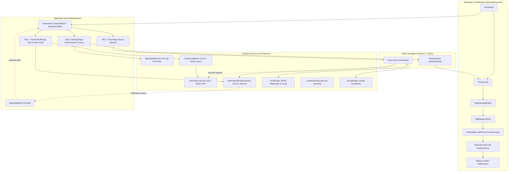

# ARCHITECTURE.md - Pomo System Architecture & Design Specification

This document explains the technical design, architectural patterns, and subsystem workflows of `pomo`, a cross-platform Pomodoro timer and 24-hour time-tracking application built with Flutter (`github.com/rawshn97/pomo`, forked from `recoskyler/pomo` and evolved here).

---

## 1. High-Level Architectural Overview

`pomo` follows a clean, modular architecture separating presentation (`lib/pages/`, `lib/widgets/`), state management (`flutter_bloc` / `Cubit`), pure domain logic (`lib/helpers/`), persistence (`lib/singletons/prefs.dart`), and platform-specific shell integration (`lib/desktop/`, `lib/services/`).

### Fork Lineage & Evolution
The original `recoskyler/pomo` project was a focused single-screen Pomodoro timer with RGB webhooks and multi-window desktop support. This fork expands the system into a unified 24-hour productivity and time-tracking suite:
- **3-Tab Navigation Shell (`HomeShell`)**: Integrates Focus Timer, 24h Hourly Tracker, and Settings without rebuilding or losing state.
- **24-Hour Activity Grid & Analytics (`TrackerShellPage`)**: Hourly time tracking, multi-tag allocations, missed hours recovery, and quiet hours.
- **Notion PARA Integration (`NotionSyncService`)**: Two-way sync for Time Logs (Pomodoro sessions) and Hourly Timeline (24h calendar slots) with tag registry sync.
- **Native Android Background Architecture**: Dedicated special-use Foreground Service (FGS), exact hourly `AlarmManager` reminders, shade notification actions, and in-app over-the-air updates (`AppUpdateService`).

### Subsystem Flow & Bootstrap



---

## 2. Application Shell: `HomeShell` & `TrackerShellPage`

### A. 3-Tab `HomeShell` (`lib/app/view/home_shell.dart`)
`HomeShell` serves as the root navigational scaffold for the application, maintaining three distinct views alive via an `IndexedStack`:
- **Tab 0: Focus Timer (`TimerPage`)**: The primary Pomodoro countdown timer with lap management, task selection, and sprint controls.
- **Tab 1: Hourly Time Tracker (`TrackerShellPage`)**: The 24-hour activity grid, daily analytics, and retroactive missed-hours logging.
- **Tab 2: Settings (`SettingsPage`)**: Comprehensive configuration for durations, audio, themes, Notion API keys, webhooks, quiet hours, and update checks.

**Adaptive Layout**:
- Wide screens (`width >= 800` dp): Renders a desktop-friendly side `NavigationRail`.
- Mobile screens (`width < 800` dp): Renders a standard Material 3 bottom `NavigationBar`.

**Programmatic Navigation**:
`AppNavigationController` (`lib/services/app_navigation_controller.dart`) provides a singleton `tabIndex` `ValueNotifier`. Native platform notifications (e.g. tapping "Open Grid" or "Log Work" on Android or macOS notification banners) mutate this notifier to switch active tabs seamlessly without re-creating widget state.

### B. `TrackerShellPage` (`lib/pages/tracker/view/tracker_shell_page.dart`)
The Hourly Time Tracker tab encapsulates:
1. **Activity Grid & Analytics (`HourlyTrackerView`)**:
   - 24-hour vertical timeline representing each hour of the day (`00:00` to `23:00`).
   - Real-time hour slot highlighting, multi-tag percentage splits, and quick bulk logging across time ranges.
   - Top-level analytics breakdown showing total logged hours vs 24 hours.
2. **Missed Hours Check (`MissedTrackingView`)**:
   - Retroactive audit finding unlogged time gaps in previous hours.
   - Quick 1-tap logging dialogs to fill unlogged blocks before end of day.
3. **Notion Deep Linking**:
   - Header button linking directly to the operator's Notion Hourly Timeline database via `NotionUrlHelper`.
4. **Android Tracker Status Prompt (`AndroidTrackerStatusPrompt`)**:
   - Prompts the user when battery optimization or exact alarm permissions are restricted on Android, ensuring hourly background reminders fire accurately.

---

## 3. Core State Management & Flow (`TimerCubit` & `SettingsCubit`)

The application state revolves around two primary `Cubit` instances provided globally via `MultiBlocProvider` in `lib/app/view/app.dart`:

### A. `TimerCubit` (`lib/pages/timer/cubit/timer_cubit.dart`)
- **State Object (`TimerState`)**: Tracks four fundamental properties:
  - `status`: `TimerStatus.running` or `TimerStatus.stopped`.
  - `duration`: The accumulated `Duration` elapsed in the current lap.
  - `lap`: The active lap type (`TimerLap.work`, `TimerLap.shortBreak`, `TimerLap.longBreak`).
  - `lapNumber`: The zero-indexed integer counter (`0` to `(lapCount * 2) - 1`) tracking overall session progress.
- **Tick Lifecycle (`tick`)**:
  1. Called periodically (typically once per second via `TimerTickService` / internal `Timer`).
  2. Adds the delta duration (`1 second`) to `state.duration`.
  3. Evaluates lap completion via `DurationHelper.isLapComplete(duration: newDuration, lap: state.lap, settingsState: settingsState)`.
  4. If complete: either automatically transitions to the next lap (`SettingsState.autoAdvance == true`) or stops the timer (`TimerStatus.stopped`) and prepares the next lap.
  5. Updates global persistent storage (`Prefs.duration = newDuration`) on each tick to guarantee resilience against unexpected restarts.

### B. `SettingsCubit` (`lib/pages/settings/cubit/settings_cubit.dart`)
- **State Object (`SettingsState`)**: Manages 30+ configuration properties including session durations (`workMinutes`, `shortBreakMinutes`, `longBreakMinutes`), lap counts (`lapCount`), theme preferences (`ThemeMode`, `colorSeed`), font selections (`TimerFont`, `timerCustomFont`), audio toggles (`enableSound`), quiet hours, and webhook URLs.
- **Persistence Synchronization**: All state mutations in `SettingsCubit` immediately write to local disk via `Prefs` (`lib/singletons/prefs.dart`), which wraps `SharedPreferences`. When `loadSettings()` is invoked during startup, `SettingsState` is reconstructed directly from disk.

---

## 4. Pure Logic Mixins (`lib/helpers/`)

To ensure maximum testability and clean separation from UI context, business logic is encapsulated in stateless helper mixins:

- `DurationHelper` (`duration_helper.dart`): Formats `Duration` into standard `MM:SS` or `-MM:SS` (`negativeFormat`) countdown strings. Computes fractional lap completion progress (`getProgress`) from `0.0` to `1.0`.
- `LapHelper` (`lap_helper.dart`): Implements `getNextLap(...)` to determine whether the upcoming lap after `lapNumber` should be `shortBreak`, `longBreak`, or `work` based on `SettingsState.lapCount`.
- `LapColorHelper` (`lap_color_helper.dart`): Maps `TimerLap` enum values to color representations used by UI themes and RGB webhook payloads.
- `HourlyLogWriter` (`hourly_log_writer.dart`): Manages local SharedPreferences storage and offline JSON queues for 24-hour log entries, tag allocation math, and quiet hours "Resting" reconciliation.

---

## 5. Notion Synchronization Subsystem (`NotionSyncService`)

`NotionSyncService` (`lib/services/notion_sync_service.dart`) bridges local app state with the user's Notion PARA workspace:

### A. Dual Database Architecture
1. **Time Logs Database (Pomodoro Sessions)**:
   - Records discrete focus sprints with task titles, tags, elapsed minutes, start/end timestamps, and Pomodoro lap metadata.
   - Created whenever a Pomodoro work lap finishes or is manually logged from `TimerPage`.
2. **Hourly Timeline Database (24h Activity Slots)**:
   - Represents the 24 hours of each day (`Hour 0` through `Hour 23`).
   - Supports multi-tag percentage splits (e.g. 50% Deep Work, 50% Reading).
   - Quiet hours fill with `Sleep & Rest` (`tag_sleep`) automatically.

### B. Activity Tag Registry & Deduplication
- Custom activity tags (name, emoji, color) are stored locally in `Prefs.activityTags` and mirrored in the Notion Hourly Timeline DB with `Source = pomo-activity-tag`.
- `TagRegistryWriter` and `TagDedupMigration` reconcile custom tags across multiple client devices.
- Deletions write local tombstones (`Prefs.deletedActivityTags`) to propagate tag deletions across PWA and desktop clients without re-sync resurrecting deleted tags.

### C. Offline Queue & Web Proxy
- All mutations update local storage first. If network requests fail or offline mode is active, logs queue in local JSON lists (`Prefs.pendingHourlyNotionLogs`).
- `flushPendingHourlyLogs()` flushes queued entries during `bootstrap()` or when network connectivity is restored.
- On Web (PWA), direct calls to `api.notion.com` fail due to CORS. The app automatically routes through an optional lightweight reverse proxy (e.g. Vercel Serverless Function `/api/notion/v1/`).

---

## 6. Android Background: FGS, Alarms & Notifications

Android uses a native MethodChannel (`com.recoskyler.pomo/timer_notification`) bridged by `AndroidNotificationService` (`lib/services/android_notification_service.dart`) and `MainActivity.kt`.

### A. Focus Timer Foreground Service (FGS)
- **Service**: `TimerForegroundService` (`SPECIAL_USE` on API 34+).
- **Notification**: ID `TIMER_NOTIFICATION_ID = 1001`, channel `pomo_timer_channel_v2` (IMPORTANCE_DEFAULT), ongoing while a session is active (Play/Pause/Stop actions).
- **Sticky policy**: `START_NOT_STICKY`. If the OS kills the service, it does not auto-restart without Dart session state (avoids a stale countdown tile). Dart restarts FGS on the next `updateTimerState` while a lap is non-zero / running.
- **D5 guard**: `startForegroundService` failures (e.g. Android 16 background start denial) fall back to `NotificationManager.notify(1001)` with the same Play/Pause/Stop actions.

### B. Hourly Check-In Shade Notification (Not FGS)
- **IDs**: `HOURLY_NOTIFICATION_ID = 1002`, channel `hourly_tracker_v2` (IMPORTANCE_HIGH, `digital_beep`). Distinct from the timer tile so both can appear together.
- **Trigger Paths**:
  1. `HourlyAlarmReceiver` (exact `AlarmManager` fire): WakeLock + sound + `TimerForegroundService.postHourlyNotification`. Runs without requiring an active Dart isolate.
  2. In-process Dart loop (`HookHelper.startHourlyTrackerLoop`): channel `showHourlyNotification` as backup when app is warm.
- Hourly is **shade-only** (auto-cancel, not ongoing FGS).
- Tap actions carry `hourly:H:YYYY-MM-DD` payload (`:log_work`, `:switch_tag`, `:open_grid`) into `MainActivity` -> `AppNavigationController`. `:log_work` writes immediately; `:switch_tag` opens the logging modal.

### C. Exact Alarms & Battery Optimizations
- `HourlyAlarmScheduler` + `BootReceiver` schedule and reschedule `RTC_WAKEUP` exact boundaries. Quiet hours are mirrored into native Android SharedPreferences and gated at fire time.
- Battery-optimization exemption requests use the same MethodChannel (`isIgnoringBatteryOptimizations` / `requestIgnoreBatteryOptimizations`), exposed via Settings and the tracker soft prompt.

---

## 7. In-App Updates & OTA Pipeline (`AppUpdateService`)

Production Android builds support full in-app Over-The-Air (OTA) updates, bypassing manual ADB or browser re-downloads:

### A. Update Architecture
- **Service (`AppUpdateService`)**: Interacts with `AppUpdateConfig.manifestUrl` (hosted on GitHub Releases or Vercel).
- **Manifest (`AppUpdateManifest`)**: Contains release version string, build number, minimum supported version, release notes, and APK download URL.
- **Download Pipeline**: `Dio` downloads the new APK into the application cache directory with real-time download progress tracking (`AppUpdatePhase.downloading`).
- **Native Installation (`AndroidApkInstallService`)**: Launches `ACTION_INSTALL_PACKAGE` or `ACTION_VIEW` via native intent, presenting the standard system package installer prompt.

### B. User Experience & Triggers
- **Automated Check**: `AppUpdateListener` (`lib/widgets/app_update_listener.dart`) checks on application cold start. If a newer release is detected, a non-intrusive dialog offers immediate download and installation.
- **Manual Check**: Users can manually trigger "Check for updates" in `SettingsPage`.

---

## 8. Desktop Multi-Window Overlay & macOS Shell Architecture

When built for desktop (`macos`, `windows`, `linux`), `pomo` integrates with native OS windowing services (`window_manager`, `desktop_multi_window`, and custom Swift plugins):

### A. Main Window vs. Overlay Window
- **Main Window (`App`)**: The standard windowed interface containing the full Pomodoro timer, hourly tracker, and settings pages.
- **Floating Overlay (`OverlayApp` in `lib/desktop/overlay_app.dart`)**: Spawns when launched with `args.firstOrNull == 'multi_window'` in `main_development.dart` or `main_production.dart`. Displays a minimal, always-on-top countdown pill floating over fullscreen applications.
- **IPC Communication**: The main window and floating overlay synchronize state across process boundaries using `desktop_multi_window` message channels (`FloatingOverlayController` / `DesktopWindowService`). When the main timer ticks or pauses, updates are broadcast instantly to the overlay window.

### B. macOS Menu Bar (`MacosMenuBarService` in `lib/desktop/macos_menu_bar_service.dart`)
- On macOS, `Pomo.app` runs in background mode when the main window is closed.
- A custom native `NSStatusItem` (`macos/Runner/MenuBarPlugin.swift`) renders the status bar icon with quick actions (`Start/Pause`, `Reset`, `Settings`, `Show Main Window`, `Quit`).

### C. Desktop Notifications & Launch at Login
- **Notifications**: `LocalNotificationService` (`flutter_local_notifications`) shows hourly check-in and lap-complete alerts. Gating lives in `NotificationHelper`; taps route through `AppNavigationController`.
- **Launch at login**: `LaunchAtLoginService` (`package:launch_at_startup`) talks to a `launch_at_startup` MethodChannel in `MainFlutterWindow.swift`, which uses `SMAppService.mainApp` (macOS 13+). Login launches start as `.accessory` (menu bar only); opening the window restores `.regular` activation.
- **DMG**: `./build_macos_dmg.sh` builds the production flavor and packages an unsigned `Pomo.dmg`.

---

## 9. Audio & Sound System (`SoundHelper` & `generate-sounds.py`)

Audio feedback is handled through `SoundHelper` (`lib/helpers/sound_helper.dart`) using the `audioplayers` package (`^6.0.0`):

### Built-in Alert Assets
- The repository bundles custom audio assets in `assets/sounds/`:
  - `click.aac`, `pop.aac`, `ding_dong.aac`
  - `chime.wav`, `bell.wav`, `digital_beep.wav`
- **Asset Generation Script**: `scripts/generate-sounds.py` is a Python utility that mathematically generates clean, royalty-free WAV tones (`chime`, `bell`, `digital_beep`) using sine wave synthesis (`44100Hz`, 16-bit PCM).

### Playback Rules
When a lap starts or ends, `SoundHelper.play(...)` checks `SettingsState.enableSound`. If enabled, it resolves whether to play the built-in sound for the active `TimerLap` or a user-specified custom audio path (`customWorkStartSound`, `customShortBreakEndSound`, etc.).

---

## 10. Webhook Automation Engine (`HookHelper`)

A key capability of `pomo` is its ability to trigger external HTTP endpoints when timer events occur (`lib/helpers/hook_helper.dart`):

### Trigger Lifecycle
Whenever `TimerCubit` starts, stops, resets, or ticks, `HookHelper` inspects `SettingsState.enableWebHooks`. If active, it fires asynchronous HTTP requests (`dio`) to configured endpoints (`workStartWebHook`, `tickWebHook`, etc.). Multiple comma-separated URLs can be executed in parallel.

### JSON Payload Specification
On every webhook invocation, `HookHelper` transmits a JSON payload containing the RGB color array corresponding to the current lap's circular progress indicator:

```json
{
  "rgb": [
    255,
    0,
    156
  ]
}
```

### HomeAssistant Integration Example
This payload is specifically structured for smart-home automation systems like HomeAssistant (`automation.yaml`):
```yaml
trigger:
  - platform: webhook
    webhook_id: "pomo-timer-tick"
action:
  - service: light.turn_on
    data:
      rgb_color: "{{ trigger.json['rgb'] }}"
      transition: 1
    target:
      entity_id: light.office_desk_bulb
```

---

## 11. Build Flavors & Entry Points

To maintain strict separation between local development, staging, and live production environments, `pomo` defines three flavors:

| Flavor | Target Entry Point | Purpose |
| :--- | :--- | :--- |
| `development` | `lib/main_development.dart` | Local debugging, verbose logging (`AppBlocObserver`), uncompressed assets. |
| `staging` | `lib/main_staging.dart` | Pre-release QA testing and staging API configurations. |
| `production` | `lib/main_production.dart` | Release builds (`build-web.sh`, `macOS .app`, `.apk`, `.deb`). |

Always ensure `--flavor` matches the target file prefix when running `flutter run` or `flutter build`.
