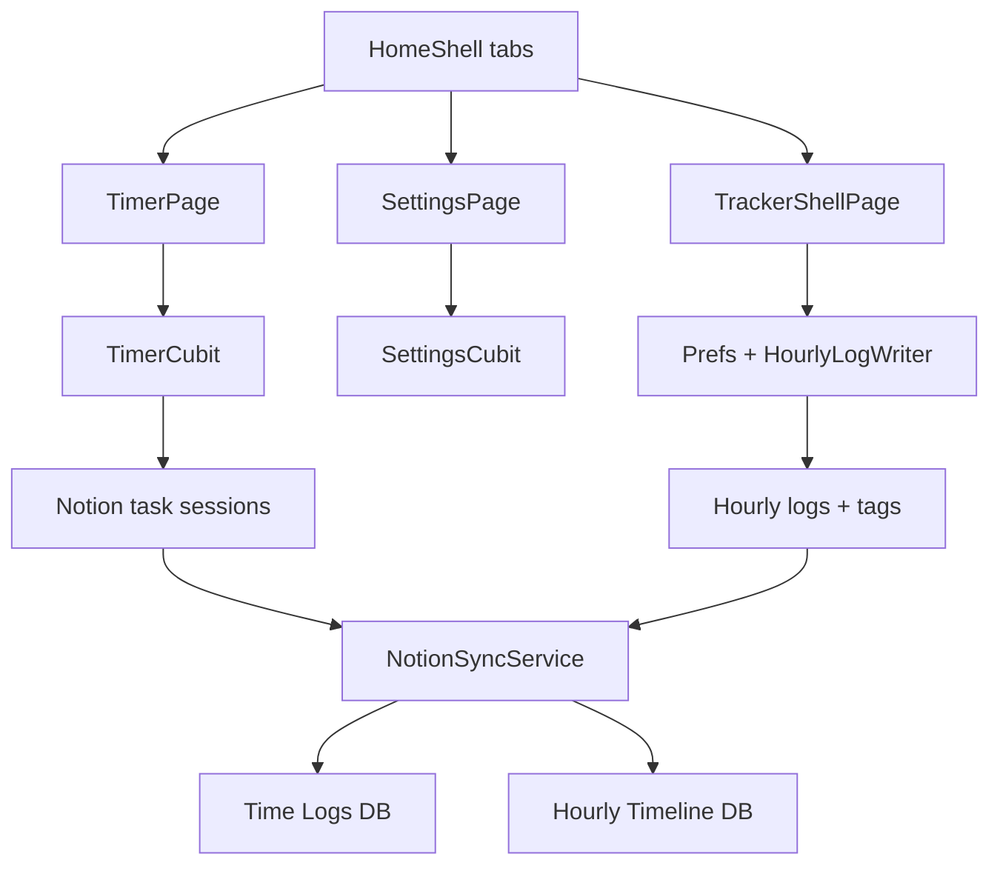

# Overview

**Parent index:** [`../SPEC.md`](../SPEC.md)  
**Module path:** app-wide

---

## Purpose

`pomo` is a **cross-platform Flutter** Pomodoro + time tracker. It captures:

1. **Focus sprints** (work / break laps) with optional Notion PARA **task** session logs.
2. **The rest of the day** via an hourly activity grid (tags, optional PARA projects, quiet-hour Resting).
3. **Automation**: RGB webhooks for lights (HomeAssistant), sounds, and platform notifications.

It is **not** Toggl/Harvest. Personal data is meant to live in the operator's Notion PARA dashboard plus local `SharedPreferences`.

## What is built (product map)

| Surface | Spec | What users get today |
|---------|------|----------------------|
| **Home shell** | this file | 3 tabs: Focus Timer, Hourly Time Tracker, Settings (`HomeShell`) |
| **Focus timer** | [timer.md](timer.md) | Pomodoro + optional Notion task picker |
| **Hourly tracker** | [hourly-tracker.md](hourly-tracker.md) | 24h grid, analytics, missed hours, tags |
| **Notion** | [notion.md](notion.md) | Time Logs DB + Hourly Timeline DB + tag registry |
| **Settings** | [settings.md](settings.md) | Durations, theme, sounds, Notion IDs, webhooks, tracker, Android battery |
| **macOS** | [desktop.md](desktop.md) | Menu bar, overlay, notifications, launch at login |
| **Android** | [android.md](android.md) | FGS timer + exact hourly alarms |
| **Web PWA** | [web.md](web.md) | Browser / Vercel-style static deploy |
| **Ops** | [ops.md](ops.md) | Flavors, verify, builds |

Shared persistence and rules: [shared.md](shared.md).

## Non-goals (shipped product)

- `fl_chart` analytics library (custom UI instead).
- `sqflite` offline queue (JSON lists in Prefs).
- Treating `lib/main.dart` as a real entry (stub only).
- iOS as a first-class tracker platform (Flutter can compile; hourly alarms / FGS are Android- and desktop-specific).

## Application shell

`HomeShell` (`lib/app/view/home_shell.dart`) keeps three pages alive:

| Index | Label | Widget |
|-------|-------|--------|
| 0 | Focus Timer | `TimerPage` |
| 1 | Hourly Time Tracker | `TrackerShellPage` (two inner tabs: grid + missed hours) |
| 2 | Settings | `SettingsPage` |

Wide layout (`>= 800` dp) uses `NavigationRail`; narrow uses bottom `NavigationBar`. `AppNavigationController` can switch tabs from notification actions.

`App` (`lib/app/view/app.dart`) provides `TimerCubit` and `SettingsCubit`, Material 3 theming from `colorSeed`, and routes: `/` → `HomeShell`, `/about`, `/deniz` (memorial page, not a product feature).

Desktop wraps with `DesktopShell` (menu bar, overlay IPC). Web/Android use the stub.

## Platforms (supported in-repo)

| Target | How it is run / shipped |
|--------|-------------------------|
| **macOS** | `flutter run --flavor development -d macos --target lib/main_development.dart`; release `.app` / `Pomo.dmg` |
| **Android** | APK scripts under `scripts/`; FGS + `AlarmManager` |
| **Web / PWA** | `flutter run ... -d chrome`; `./scripts/build-web.sh` |

Linux / Windows / iOS exist in the Flutter tree; desktop overlay and hourly native alarms are **not** specified as fully equivalent to macOS/Android.

## Flavors

| Flavor | Entry | Use |
|--------|-------|-----|
| `development` | `lib/main_development.dart` | Local debug; overlay arg `multi_window` |
| `staging` | `lib/main_staging.dart` | Pre-release |
| `production` | `lib/main_production.dart` | Release web / macos / apk |

Always pass `--flavor` and `--target`. Overlay window is the same entry with `args.first == 'multi_window'`.

## Bootstrap (all platforms)

`bootstrap()` (`lib/bootstrap.dart`):

1. `Prefs().init()`
2. `HookHelper.startHourlyTrackerLoop()`
3. Flush pending hourly Notion rows
4. `pullHourlyLogs` → `HourlyLogWriter.reconcileResting` → `syncActivityTags`
5. Desktop: window manager, macOS notification init, optional start-hidden login launch

## High-level diagram

## Document history

| Date | Change |
|------|--------|
| 2026-09-03 | Initial shipped overview |
